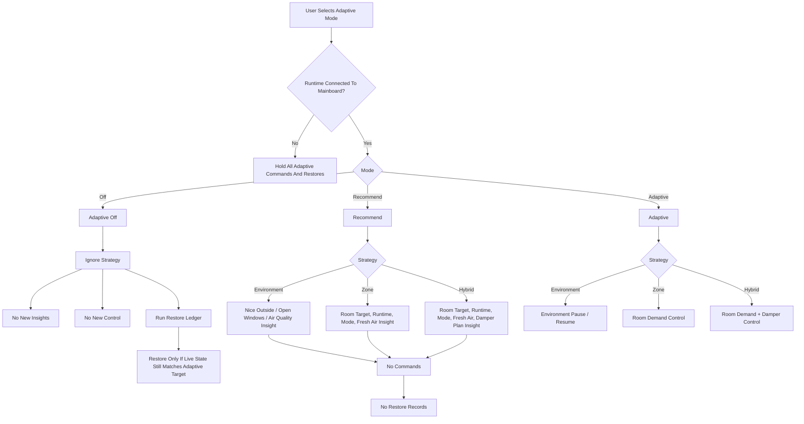
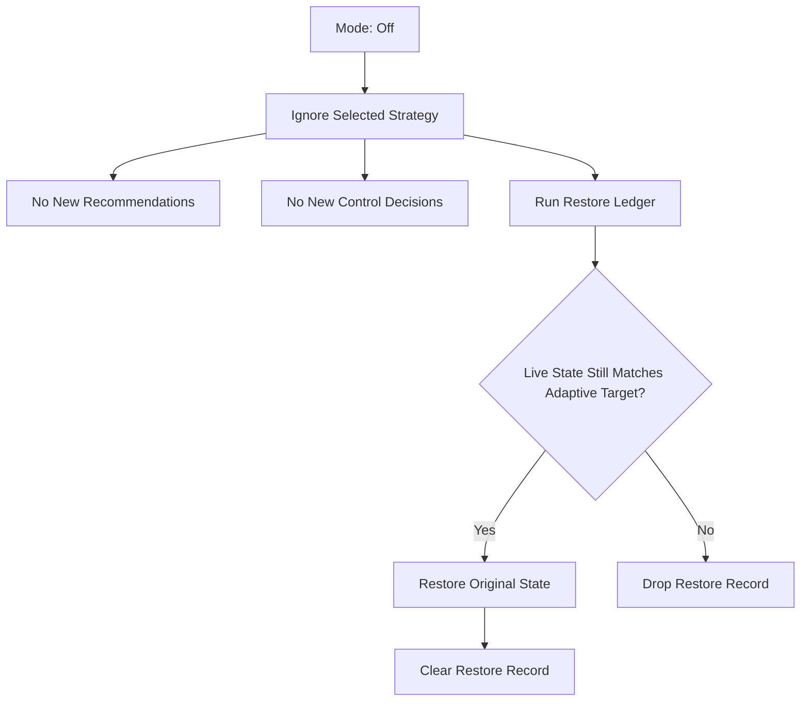
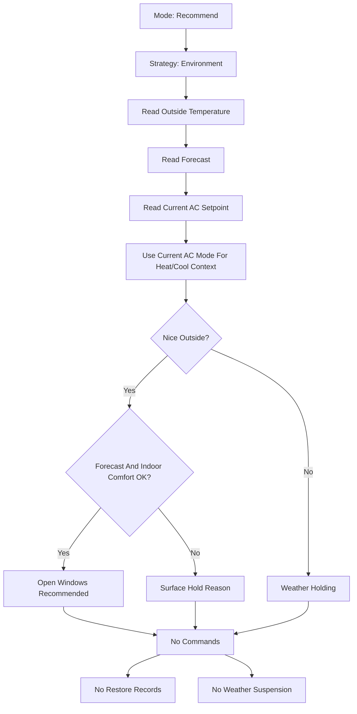
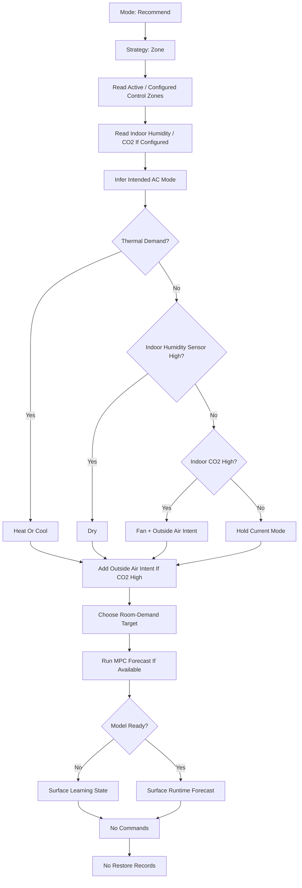
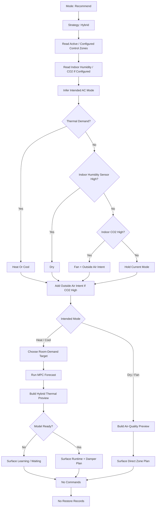
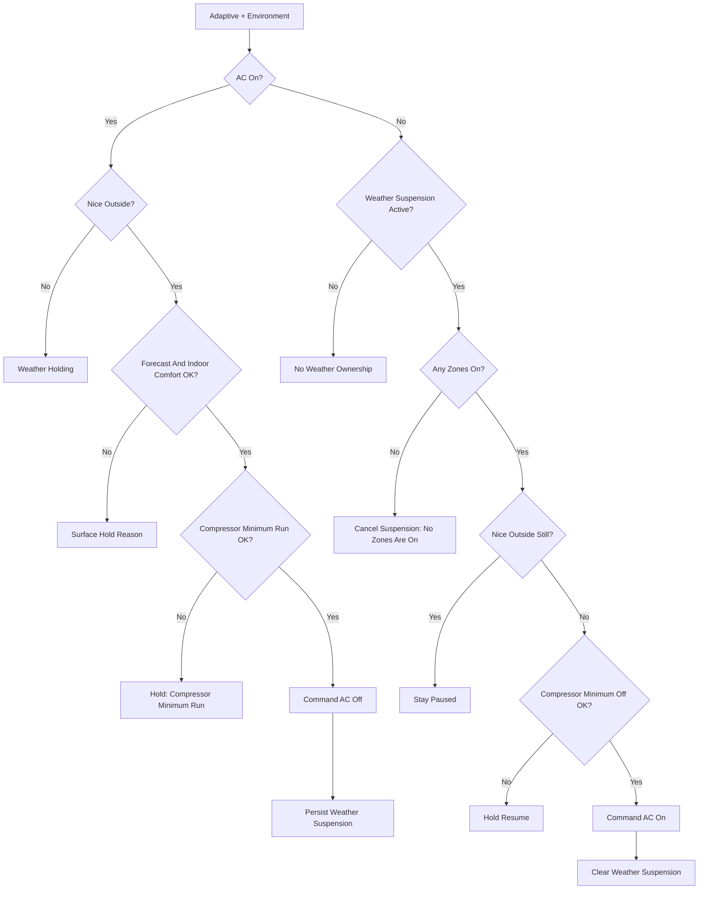
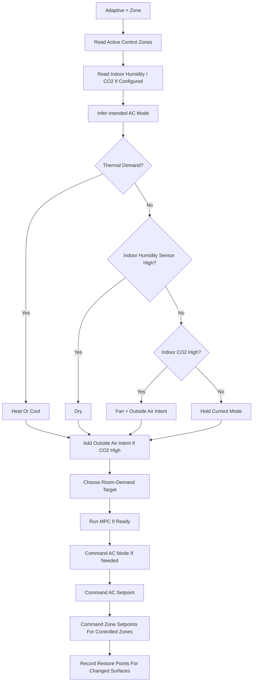
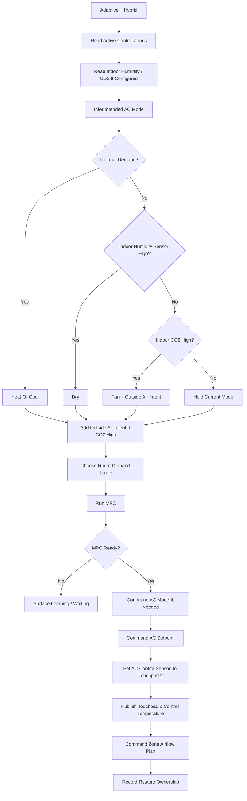

# Adaptive Control Flow

This is the working control-flow map for the adaptive layer. It separates user mode, strategy, control outputs, restore ownership, and Environment pause/resume ownership.

## Mode And Strategy Overview

Runtime connection guard:

- Adaptive only commands when OpenAirTouch reports `runtime.connected`.
- If the runtime is not connected to the mainboard, no mode, strategy, damper, Touchpad 2 temperature, or restore command is emitted.
- Restore records remain owned by adaptive until a connected runtime confirms whether the adaptive target is still active.

Learning model inputs:

- Active room observations carry the AirTouch-derived room `power_fraction` into the thermal prediction and EKF update path.
- The fraction is the translator's estimated share of active-zone delivery; when no damper percentages are available it falls back to an equal share across active rooms.
- The same value remains exposed in adaptive analytics as `estimated_power_fraction` so model behavior and source telemetry can be inspected together.

## Off Mode

Off disables adaptive decision-making for every selected strategy. It does not mean AC power off.

Allowed outputs:

- Restore AC mode if adaptive changed it.
- Restore AC setpoint/control temperature if adaptive changed it.
- Restore zone setpoint if adaptive changed it.
- Restore manual damper percentage only when the zone was already in manual damper mode.
- Return a zone to sensor/setpoint control if adaptive moved it from AirTouch sensor control to manual damper control.

Not allowed:

- No Environment recommendations.
- No Zone recommendations.
- No Hybrid recommendations.
- No AC power-off command just because adaptive mode is Off.
- No new restore records.

This block covers:

- `Off + Environment`
- `Off + Zone`
- `Off + Hybrid`

## Recommend + Environment

Recommend + Environment is insight-only. It tells the user when outside air or indoor air quality can help, but it cannot pause or resume the AC.

User-facing examples:

- `Nice Outside`
- `Open Windows Recommended`
- `Outside Air Can Carry The Load`
- `Forecast Looks Helpful For 3.0 H`
- `Weather Off Held By Forecast`
- `Weather Off Held By Indoor Comfort`
- `Dehumidification Recommended`
- `Fresh Air Recommended`

Runtime thresholds:

- `Dry Humidity Threshold`, default `70%`
- `CO2 Ventilation Threshold`, default `1000 ppm`
- Cooling humidity assist starts `10%` below `Dry Humidity Threshold`.

Structured UI output should include:

- `weather_intent.intent`
- `weather_intent.headline`
- `weather_intent.summary`
- `weather_intent.reason`
- `weather_intent.outside_temperature`
- `weather_intent.setpoint`
- `weather_intent.nice_outside`
- `weather_intent.open_windows`
- `weather_intent.pause_recommended`
- `weather_intent.nice_window_minutes`

## Recommend + Zone

Recommend + Zone is insight-only room-demand forecasting. It can infer what the system should do, but it cannot command AC mode, AC setpoint, zone setpoint, or dampers.

User-facing examples:

- `Recommended Target: 22 C`
- `Heating Expected`
- `Cooling Expected`
- `Dehumidification Recommended`
- `Fresh Air Recommended`
- `Fan And Outside Air Recommended`
- `Outside Air Recommended`
- `Expected Runtime: 1.5 H`
- `Living Room Needs Cooling`
- `Model Learning: Waiting For More Samples`

Structured UI output should include:

- `mode_intent`
- `intended_ac_mode`
- `mode_intent.outside_air_intent`
- `mode_intent.ventilation_reason`
- `recommended_target`
- `runtime_hours`
- `affected_zones`
- `mpc.runtime_forecast`
- `mpc.zone_projected_runtime_hours`
- `learning.zones`

Control outputs:

- None.
- Outside air zone selection is surfaced as OpenAirTouch adaptive runtime config.
- Recommend mode still does not command the selected outside-air zones.

Restore impact:

- No restore records.

## Recommend + Hybrid

Recommend + Hybrid is insight-only. Heat/Cool uses the Hybrid thermal preview. Dry/Fan bypass Hybrid maths and surface an air-quality preview instead.

User-facing examples:

- `Recommended Target: 22 C`
- `Expected Runtime: 1.5 H`
- `Damper Plan: Living 80%, Bedroom 30%`
- `Control Temperature: 23.1 C`
- `Model Learning: Waiting For Selected Control Zones`
- `Dehumidification Recommended`
- `Zones Would Open: Living`
- `Fresh Air Recommended`
- `Outside Air Zones Would Open: Outside Air`
- `Humidity High: Thermal Mode Preferred`
- `CO2 High: Outside Air Recommended`

Structured UI output should include:

- `mode_intent`
- `mode_intent.outside_air_intent`
- `mode_intent.ventilation_reason`
- `recommended_target`
- `runtime_hours`
- `affected_zones`
- `hybrid.control_temperature`
- `hybrid.damper_percentages`
- `hybrid.touchpad_temperature_commanded`
- `air_quality.humidity_high`
- `air_quality.co2_high`
- `air_quality.dry_recommended`
- `air_quality.dry_held_reason`
- `air_quality.fan_recommended`
- `air_quality.fan_held_reason`
- `air_quality.dry_zone_ids`
- `air_quality.outside_air_zone_ids`
- `mpc.runtime_forecast`

Control outputs:

- None.
- Outside air zone selection is surfaced as OpenAirTouch adaptive runtime config.
- Recommend mode still does not command the selected outside-air zones.

Restore impact:

- No restore records.

Important rule:

- Hybrid thermal preview only applies to Heat/Cool.
- Dry/Fan is an air-quality preview, not a Hybrid damper optimisation.
- If Heat/Cool demand is active, Dry/Fan mode change is held and air quality is surfaced as an assist note.

## Adaptive + Environment

Environment is an opportunistic AC pause/resume and indoor air-quality lifecycle. It is not a setpoint optimizer and it does not use the restore ledger.

Environment ownership rules:

- Environment may pause an AC only when the AC is on.
- Environment may resume only from an active Environment suspension.
- If all zones under the AC turn off, cancel Environment suspension.
- If AC power changes externally, cancel Environment suspension.
- Once Environment resumes the AC, ownership ends.
- If the user turns the AC off after Environment resumes, Environment must not turn it back on again.

Control outputs:

- AC power off when outside air can carry the load.
- AC power on only when resuming from an active Weather suspension.

Restore impact:

- No restore records.
- Environment currently uses `weather_state.suspensions`, not `restore_state`.

## Adaptive + Zone

Zone strategy uses room-level state to infer the intended AC mode and target.

Control outputs:

- AC mode: Heat/Cool when inferred from room demand.
- AC mode: Dry only when an indoor humidity sensor exists and reports high humidity.
- AC mode: Fan when temperatures are comfortable and indoor CO2 is high.
- Open selected `outside_air_zones` to 100% when indoor CO2 is high, including during Heat/Cool.
- AC setpoint/control temperature.
- Zone setpoint for controlled zones.

Outside-air selection:

- `outside_air_zones` is OpenAirTouch adaptive runtime config, mirroring `control_zones`.
- It is not the AirTouch spill-zone configuration table.
- Restore returns the selected zone to its previous damper or sensor-control state when outside-air intent clears.

Restore:

- AC mode and setpoint use the restore ledger.
- Zone setpoint uses the restore ledger.
- Restore only applies if the live state still matches the adaptive target.

## Adaptive + Hybrid

Hybrid extends Zone with damper planning and manufactured control temperature.

Control outputs:

- AC mode: Heat/Cool from room demand, Dry from indoor humidity, Fan from high CO2 when thermal demand is comfortable.
- Open selected `outside_air_zones` to 100% when indoor CO2 is high, including during Heat/Cool.
- AC setpoint.
- AC control sensor set to Touchpad 2 when Hybrid owns manufactured control temperature.
- Touchpad 2 synthetic temperature, calculated from aggregate controlled-zone demand.
- Zone airflow plan.

Outside-air selection:

- `outside_air_zones` is OpenAirTouch adaptive runtime config, mirroring `control_zones`.
- It is not the AirTouch spill-zone configuration table.
- Restore returns the selected zone to its previous damper or sensor-control state when outside-air intent clears.

Hybrid restore rule:

- Restore the original AC control sensor when Hybrid no longer owns manufactured control temperature.
- If a zone was already manual damper control, restore the original damper percentage.
- If Hybrid moved a sensor-control zone into manual damper control, restore by returning the zone to sensor/setpoint control.
- Do not replay stale damper percentage after handing control back to AirTouch.

Command translation:

- UI and Adaptive both express the same intent actions: `ac_setting_new`, `sensor_temperature`, `group_percentage`, and `group_setpoint`.
- The command layer translates those actions into AirTouch payloads.
- The UI should surface the resulting runtime state, including zone damper mode and Hybrid Touchpad 2 control temperature.

## UI Surfaces

The UI should show:

- Current intent.
- Reason.
- Expected time window.
- Runtime forecast.
- Control ownership.
- Restore or pause/resume state when active.

See `adaptive-ui-surface.md` for UI copy, chart layers, and suggested structured fields.
